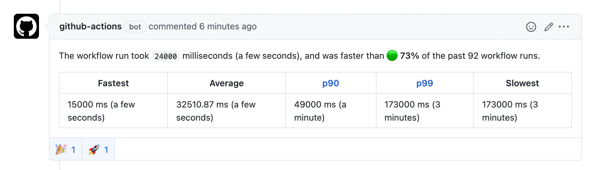

# GitHub Build Stats

[](https://github.com/getoslash/github-build-stats-action/releases)
[](https://github.com/getoslash/github-build-stats-action/actions?query=workflow%3Arelease)


[](https://open.vscode.dev/getoslash/github-build-stats-action)

This action gets you detailed statistics of your workflow runs.



## Inputs

### `token`

GitHub API token.

### `workflowId`

Workflow ID. You can use the workflow file's name.

### `pullRequest` (optional)

Pull request number. Can be optionally used when the action cannot find the PR number correctly.

## Outputs

### `stats`

Detailed workflow run statistics.

## Example usage

> All examples assume you already have a `build.yml` in `.github/workflows/` that is the workflow you'd like to get stats for.

1. Using the [`workflow_dispatch`](https://docs.github.com/en/actions/reference/events-that-trigger-workflows#workflow_dispatch) event (**[Recommended](https://securitylab.github.com/research/github-actions-preventing-pwn-requests/)**). This is recommended for projects that accept external contributions from forks.

    1. Include a final step under `jobs.<job-id>.steps` in `.github/workflows/build.yml`.

        ```yaml
        steps:
          - name: Trigger build stats action
            uses: peter-evans/repository-dispatch@v1
            with:
              token: ${{ secrets.TOKEN }} # Use a custom personal access token.
              event-type: trigger-stats
              client-payload: '{"pull_request": {"number": "${{ github.event.number }}"}}'
        ```
        This will manually trigger the stats workflow.

        **ℹ️ Note for open-source projects that accept PRs from external forks** – for this `workflow_dispatch` to work, you will need to turn on _"Run workflows from fork pull requests"_ and _"Send secrets to workflows from fork pull requests"_ in your repository's settings.

    2. Create a separate workflow, say `.github/workflows/build-stats.yml` that will listen to the `trigger-stats` event from the above step.

        ```yaml
        name: Workflow run stats

        on:
          repository_dispatch:
            types: [trigger-stats]

        jobs:
            post-stats:
              runs-on: ubuntu-latest
              steps:
                - name: Post stats
                  uses: 'getoslash/github-build-stats-action@latest'
                  with:
                    token: ${{ secrets.GITHUB_TOKEN }}
                    workflowId: build.yml
        ```

2. Using the [`workflow_run`](https://docs.github.com/en/actions/reference/events-that-trigger-workflows#workflow_run) event. This is recommended for projects that accept only same-origin PRs and not PRs from external forks.

    1. Create a separate workflow, say `.github/workflows/build-stats.yml`.

        ```yaml
        name: Workflow run stats

        on:
          workflow_run:
            workflows:
              - 'build.yml'
            types:
              - completed

        jobs:
          post-stats:
            runs-on: ubuntu-latest
            steps:
              - name: Post stats
                uses: 'getoslash/github-build-stats-action@latest'
                with:
                  token: ${{ secrets.GITHUB_TOKEN }}
                  workflowId: build.yml
                  pullRequest: ${{ github.event.number }}
        ```

## Licenses

The code in this project is released under the [MIT License](LICENSE).

[](https://app.fossa.com/projects/git%2Bgithub.com%2Fgetoslash%2Fgithub-build-stats-action?ref=badge_large)
